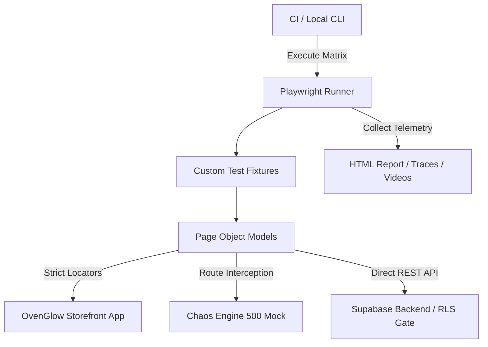

# 🥐 OvenGlow Bakery - Enterprise E2E Test Automation Framework

[](https://playwright.dev/)
[](https://www.typescriptlang.org/)
[](https://github.com/)
[](https://github.com/features/actions)
[](https://nodejs.org/)

Production-grade, enterprise-standard End-to-End (E2E) automation framework jo **OvenGlow Bakery** web application ke liye design kiya gaya hai. Isme Page Object Model (POM), custom dependency injection fixtures, strict locator scoping, network chaos simulation, aur PostgreSQL Row Level Security (RLS) policies par 100% reliable test coverage provide kiya gaya hai.

---

## 🏛️ Framework Architecture

Framework modular separation aur dependency injection follow karta hai jisse zero test flakiness aur high maintainability ensure hoti hai:

```text
ovenglow-playwright-automation/
├── .github/workflows/
│   └── playwright.yml            # CI/CD Regression pipeline with artifacts
├── docs/
│   ├── BUG_REPORTS.md            # Defect triage & root cause analysis (RCA)
│   ├── CI_CD_PIPELINE.md         # CI execution & failure triage guide
│   ├── TEST_CASES.md             # Detailed scenarios & steps breakdown
│   ├── TEST_EXECUTION_MATRIX.md  # Requirements Traceability Matrix (RTM)
│   ├── TEST_EXECUTION_REPORT.md  # Test execution metrics & run summary
│   └── TEST_STRATEGY.md          # Quality engineering strategy document
├── src/
│   ├── data/
│   │   └── testData.ts           # Dynamic test fixtures & payloads
│   ├── fixtures/
│   │   └── testFixtures.ts       # Dependency-injected Page Object fixtures
│   └── pages/
│       ├── BasePage.ts           # Core automation abstractions & utility
│       ├── CartDrawerPage.ts     # Sliding drawer, quantity, pricing math
│       ├── CheckoutModalPage.ts  # Express checkout modal & order placement
│       ├── KitchenConsolePage.ts # Live dispatch dashboard & staff console
│       └── StorefrontPage.ts     # Menu catalog, search, and filters
├── tests/
│   └── e2e/
│       ├── catalog/              # Search, eggless toggle & zero-state tests
│       ├── cart/                 # Delivery fee boundaries & zero-state removal
│       ├── checkout/             # E2E order flow, slots & network chaos (500)
│       ├── security/             # Row Level Security (RLS) API checks
│       └── staff/                # Auth barrier, invalid login & live dispatch
├── playwright.config.ts          # Multi-browser & reporter configuration
└── tsconfig.json                 # Path aliases (@pages, @fixtures)
```

### High-Level Interaction Flow



---

## 🎯 Test Suite Highlights & Coverage (25 Tests)

1. **Catalog & Search:** Real-time query debouncing, 100% Eggless dietary toggle filtering, zero-state search fallback.
2. **Pricing & Cart Math Engine:**
   - Free delivery threshold calculation (`>= ₹499`).
   - Flat delivery fee enforcement (`₹49` on orders `< ₹499`).
   - Single item quantity decrement down to zero (`1 -> 0`) with auto-removal from cart.
3. **Express Checkout Operations:**
   - Full customer lifecycle with automated `#OG-XXXXXX` Order ID generation.
   - HTML5 required field enforcement on empty submissions.
   - Instant vs Scheduled delivery slot state switching.
4. **Resilience & Chaos Engineering:**
   - Browser refresh resilience (UI health check across `page.reload()`).
   - Network failure simulation: Server `500 Internal Server Error` interception via `page.route()`.
   - Responsive mobile viewport drawer rendering and dismissal.
5. **Staff Kitchen Operations & Security:**
   - Guest authentication barrier enforcing login prompts.
   - Invalid credential rejection and error toasts.
   - Real-time WebSocket connection state validation.
   - PostgreSQL Row Level Security (RLS) verification (anonymous REST access block).

---

## ⚙️ Prerequisites

* **Node.js**: `v18.x` ya `v20.x` LTS
* **npm**: `v9.x` ya newer
* **Git** installed on your system

---

## 🚀 Getting Started

### 1. Repository Clone Karein
```bash
git clone [https://github.com/](https://github.com/)<your-username>/ovenglow-playwright-automation.git
cd ovenglow-playwright-automation
```

### 2. Dependencies Install Karein
```bash
npm install
```

### 3. Playwright Browsers Download Karein
```bash
npx playwright install --with-deps
```

### 4. Environment Variables Configure Karein
Root directory me `.env` file create karein:
```env
BASE_URL=[https://ovenglow-bakery.vercel.app](https://ovenglow-bakery.vercel.app)
STAFF_EMAIL=staff@ovenglow.com
STAFF_PASSWORD=YourSecurePassword123
CI=false
```

---

## 🧪 Test Execution Commands

### Poora Test Suite Run Karein (Parallel)
```bash
npx playwright test tests/e2e/ --project=Chromium
```

### Specific Feature Modules Run Karein
```bash
# Cart & Pricing Engine Tests
npx playwright test tests/e2e/cart/ --project=Chromium

# Express Checkout & Chaos Scenarios
npx playwright test tests/e2e/checkout/ --project=Chromium

# Kitchen Staff Operations Suite
npx playwright test tests/e2e/staff/ --project=Chromium

# Catalog & Search Suite
npx playwright test tests/e2e/catalog/ --project=Chromium

# Security & RLS Suite
npx playwright test tests/e2e/security/ --project=Chromium
```

### Interactive & Debug Modes
```bash
# Interactive UI Mode (Step-by-step time travel debugging)
npx playwright test --ui

# Headed Execution (Browser view open karke run karein)
npx playwright test --headed

# Single Test Debug Mode (Playwright Inspector)
npx playwright test tests/e2e/cart/cartPricingEdgeCases.spec.ts --debug
```

---

## 📊 Reports & Diagnostics

Test execution ke baad HTML report aur trace inspect karne ke liye:

```bash
# HTML Report view karein
npx playwright show-report

# Failed trace file inspect karein
npx playwright show-trace test-results/<test-run-folder>/trace.zip
```

---

## 🛡️ Best Practices & Quality Standards

* **No Arbitrary Sleep Waits:** Auto-waiting assertions (`toBeVisible()`, `networkidle`) state transitions ko handle karte hain.
* **Strict Mode Compliance:** Saare locators header/aside containers me strictly scoped hain taaki multiple element matching errors na aayein.
* **Trace on Failure:** Har failed test run ke screenshots, DOM state snapshot, aur video recordings CI pipeline me automatically capture hoti hain.
* **Zero Mutation:** Har test case stateless fixture use karta hai jisse parallel runs me data collision nahi hota.

---

## 📚 Detailed Documentation

* [Test Strategy & Quality Engineering Blueprint](docs/TEST_STRATEGY.md)
* [Requirements Traceability Matrix (RTM)](docs/TEST_EXECUTION_MATRIX.md)
* [Test Execution & Run Metrics Report](docs/TEST_EXECUTION_REPORT.md)
* [Defect Triage & Root Cause Analysis Log](docs/BUG_REPORTS.md)
* [CI/CD Execution & Artifacts Guide](docs/CI_CD_PIPELINE.md)
* [Comprehensive Test Cases & Scenarios](docs/TEST_CASES.md)

---

## 🤝 Contributing & Standards
1. Fork repository and create feature branch (`git checkout -b feature/cart-enhancement`).
2. Write automated tests in `tests/e2e/<module>/`.
3. Verify all 25 tests pass locally: `npx playwright test tests/e2e/ --project=Chromium`.
4. Commit using conventional commits (`feat: add cart currency boundary check`).
5. Open Pull Request against `main`.